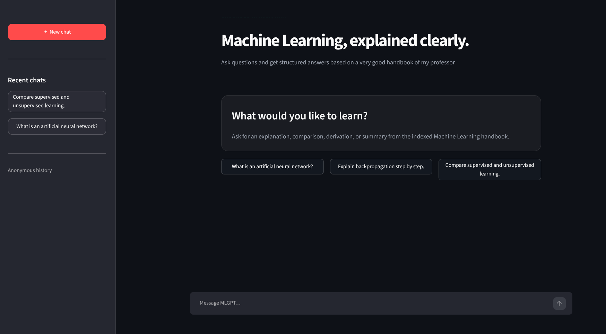
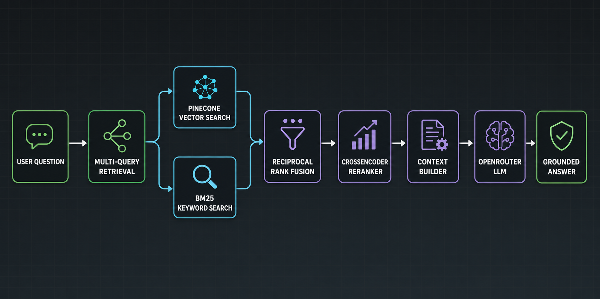

# MLGPT — Production-Style RAG Chatbot

MLGPT is a document-grounded question-answering application built from
scratch with a production-oriented Retrieval-Augmented Generation (RAG)
pipeline. It answers questions from an indexed Machine Learning course
handbook and presents the results through a clean Streamlit chat interface.



## What It Does

- Loads and splits PDF documents into searchable chunks.
- Generates dense embeddings with Jina AI.
- Stores and searches vectors in Pinecone.
- Combines semantic vector search with BM25 keyword search.
- Uses Reciprocal Rank Fusion (RRF) to merge both rankings safely.
- Applies a CrossEncoder reranker before building the final context.
- Generates grounded answers through OpenRouter.
- Exposes the RAG pipeline through FastAPI.
- Stores bounded conversation memory and anonymous chat history in Redis.
- Provides a ChatGPT-style Streamlit interface with reopenable conversations.

## RAG Architecture



The Streamlit frontend communicates with FastAPI over HTTP. FastAPI owns the
RAG workflow and uses Redis to store recent messages and conversation metadata.

## Technology Stack

- Python
- FastAPI and Uvicorn
- Streamlit
- Redis
- Pinecone
- OpenRouter
- Jina embeddings
- BM25 (`rank-bm25`)
- Sentence Transformers CrossEncoder
- LangChain PDF loader and text splitter

## Project Structure

```text
RAG-Nil/
├── assets/                  # README images
├── data/                    # PDFs and persisted chunk catalog
├── prompts/                 # RAG and query-rewrite prompts
├── src/
│   ├── api/main.py          # FastAPI routes
│   ├── conversation_store.py
│   ├── redis_memory.py
│   ├── retriever.py         # Hybrid retrieval, MQR and RRF
│   ├── reranker.py
│   ├── vector_store.py
│   ├── indexer.py
│   └── chatbot.py
├── main.py                  # CLI indexing and chat entry point
├── streamlit_app.py         # User-facing chat interface
└── pyproject.toml
```

## Local Setup

### 1. Install dependencies

Install `uv`, then synchronize the project environment:

```bash
uv sync
```

### 2. Configure environment variables

Create a `.env` file in the repository root:

```env
OPENROUTER_API_KEY=your_openrouter_api_key
JINA_API_KEY=your_jina_api_key
PINECONE_API_KEY=your_pinecone_api_key
PINECONE_INDEX_NAME=your_pinecone_index_name

REDIS_URL=redis://localhost:6379/0
CONVERSATION_TTL_SECONDS=86400
```

Never commit real API keys to version control.

### 3. Start Redis

Using Docker:

```bash
docker run --name rag-redis -p 6379:6379 -d redis:7-alpine
```

If the container already exists:

```bash
docker start rag-redis
```

### 4. Index a PDF

```bash
uv run python main.py --mode index --pdf "data/ml-Ajay Anand.pdf"
```

This creates the local chunk catalog for BM25, generates embeddings, and
uploads the corresponding vectors and metadata to Pinecone.

### 5. Start the FastAPI backend

```bash
uv run uvicorn src.api.main:app --reload --port 8001
```

Useful endpoints:

- API documentation: `http://127.0.0.1:8001/docs`
- Health check: `http://127.0.0.1:8001/health`
- Chat endpoint: `POST /v1/chat`

### 6. Start the Streamlit frontend

Open a second terminal:

```bash
RAG_API_URL=http://127.0.0.1:8001 uv run streamlit run streamlit_app.py
```

Open `http://localhost:8501` in a browser.
